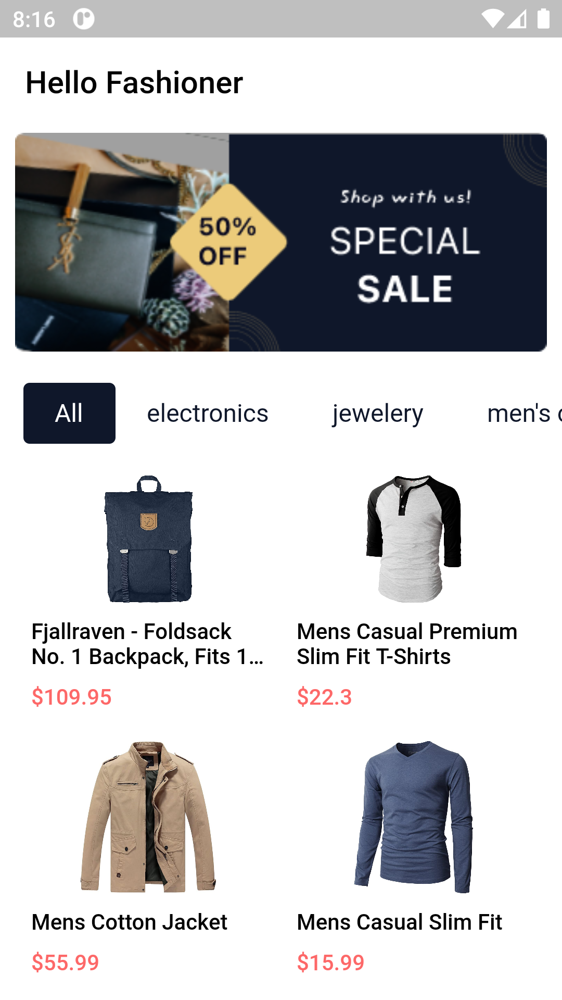

# React capstone project: FAKESTORE (Module 3)

<div align="center">
  
  <br/>

  <h3><b>React capstone project: FAKESTORE</b></h3>

</div>
<!-- TABLE OF CONTENTS -->

# 📗 Table of Contents

- [📗 Table of Contents](#-table-of-contents)
- [📖 React metrics webapp capstone project ](#metrics-webapp-capstone-project)
  - [🛠 Built With ](#-built-with-)
    - [Tech Stack ](#tech-stack-)
    - [Key Features ](#key-features-)
      - [🔭 Future Features ](#-future-features-)
  - [🚀 Live Demo ](#-live-demo-)
  - [🚀 Project Presentation Video ](#-project-presentation-video-)
  - [💻 Getting Started ](#-getting-started-)
    - [Setup](#setup)
    - [Install](#install)
    - [Usage](#usage)
    - [Testing](#testing)
    - [Deployment](#deployment)
  - [👥 Authors](#-authors)
  - [🤝 Contributing ](#-contributing-)
  - [⭐️ Show your support ](#️-show-your-support-)
  - [🙏 Acknowledgments ](#-acknowledgments-)
  - [📝 License ](#-license-)

<!-- PROJECT DESCRIPTION -->

# 📖 Fakestore <a name="about-project"></a>

 This capstone project is about building a mobile web app for clothing, electronics and jewelry e-commerce consuming the Fake Store API, using JavaScript, Styled Components, Context API, axios and more created by making use of React and Redux. An API (https://fakestoreapi.com/) is used to provide data about shop and then build the webapp around it. The webapp will have two pages: one page with a list of items (homepage) and another page for the item details. 
 Original Design Official by [Nelson Sakwa](https://www.behance.net/gallery/31579789/Ballhead-App-%28Free-PSDs%29).

## 🛠 Built With <a name="built-with"></a>

### Tech Stack <a name="tech-stack"></a>

<details>
  <summary>Client</summary>
  <ul>
    <li><a href="https://reactjs.org/">React.js</a></li>
    <li>Redux</li>
    <li>React Router</li>
    <li><a href="https://html.com/">Html5</a></li>
    <li><a href="hhttps://www.w3schools.com/css/">CSS3</a></li>
    <li>JS</li>
    <li>ESLint</li>
    <li>StyleLints</li>
    <li>GitFlow</li>
    <li><a href="https://www.javascript.com/">ES6</a></li>
    <li>Webpack</li>
    <li>Jest</li>
  </ul>
</details>

<details>
  <summary>Server</summary>
  <ul>
    <li><a href="#">N/A</a></li>
  </ul>
</details>

<details>
<summary>Database</summary>
  <ul>
    <li><a href="#">N/A</a></li>
  </ul>
</details>

<!-- Features -->

### Key Features <a name="key-features"></a>

- **[Dynamically]**
- **[Git-flow]**
- **[Good-HTML-JS-and-CSS-practices]**
- **[ES6-modules]**
- **[react-Jest-tests]**
- **[react-Webpack]**

<p align="right">(<a href="#readme-top">back to top</a>)</p>

#### 🔭 Future Features <a name="future-features"></a>


<!-- LIVE DEMO -->

## 🚀 Live Demo <a name="live-demo"></a>
# [FAKESTORE](https://fakestoreapi-898e.onrender.com)

<p align="right">(<a href="#readme-top">back to top</a>)</p>

## 🚀 Project Demonstration Video <a name="Demonstration Video"></a>

- [Demo-Video-for-metrics-webapp-capstone-project](https://www.loom.com/share/cd75bd9d2a5b4ebe8d9a3adebcccea34)


<p align="right">(<a href="#readme-top">back to top</a>)</p>

<!-- GETTING STARTED -->

## 💻 Getting Started <a name="getting-started"></a>

To get a local copy up and running, follow these steps.

### Setup

Clone this repository to your desired folder:

```sh
  git clone https://github.com/jugosack/react-capstone-fakestore.git
```

### Install

Install this project with:

```sh
  npm install
```

### Usage

### Install

After cloning the repo you need to install de dependencies.
- Run this command in the project folder:
 <code>npm install</code>

To run the project, execute the following command:

- Builds the app for production to the build folder. It correctly bundles React in production mode and optimizes the build for the best performance. run:
 <code>npm run build</code>

 - Runs the app in the development mode. Open http://localhost:3000 to view it in the browser: run
 <code>npm start</code>

### Run tests

To run tests, run the following command:
 <code>npm test</code>### Testing

### Deployment
[FAKESTORE](https://)


<p align="right">(<a href="#readme-top">back to top</a>)</p>

<!-- AUTHORS -->

## 👥 Authors

<a name="authors"></a>

👤 **Jugoslav Achkoski**

- GitHub: [@github](https://github.com/jugosack)
- LinkedIn: [LinkedIn](https://www.linkedin.com/in/jugoslavachkoski/)
- Twitter: [twitter](https://twitter.com/Jugoslav_A)
- Facebook: [facebook](https://www.facebook.com/jugoslav.ackoski/)

<p align="right">(<a href="#readme-top">back to top</a>)</p>


<!-- CONTRIBUTING -->

## 🤝 Contributing <a name="contributing"></a>

Contributions, issues, and feature requests are welcome!
Feel free to check the [issues page](https://github.com/jugosack/react-capstone-fakestore/issues).

<p align="right">(<a href="#readme-top">back to top</a>)</p>

<!-- SUPPORT -->

## ⭐️ Show your support <a name="support"></a>

If you like this project take the time to give a star, follow us and a feedback, we will appreciate it.

<p align="right">(<a href="#readme-top">back to top</a>)</p>

<!-- ACKNOWLEDGEMENTS -->

## 🙏 Acknowledgments <a name="acknowledgements"></a>

I would like to thank microverse for the great resources shared. Also I would like to thanks [Nelson Sakwa](https://www.behance.net/gallery/31579789/Ballhead-App-%28Free-PSDs%29) on Behance for Original Design Official.

<p align="right">(<a href="#readme-top">back to top</a>)</p>

<!-- LICENSE -->

## 📝 License <a name="license"></a>

This project is [MIT](./LICENSE) licensed

<p align="right">(<a href="#readme-top">back to top</a>)</p>


Runs the app in the development mode.\
Open [http://localhost:3000](http://localhost:3000) to view it in your browser.

The page will reload when you make changes.\
You may also see any lint errors in the console.

### `npm test`

Launches the test runner in the interactive watch mode.\
See the section about [running tests](https://facebook.github.io/create-react-app/docs/running-tests) for more information.

### `npm run build`

Builds the app for production to the `build` folder.\
It correctly bundles React in production mode and optimizes the build for the best performance.

The build is minified and the filenames include the hashes.\
Your app is ready to be deployed!

See the section about [deployment](https://facebook.github.io/create-react-app/docs/deployment) for more information.

### `npm run eject`

**Note: this is a one-way operation. Once you `eject`, you can't go back!**

If you aren't satisfied with the build tool and configuration choices, you can `eject` at any time. This command will remove the single build dependency from your project.

Instead, it will copy all the configuration files and the transitive dependencies (webpack, Babel, ESLint, etc) right into your project so you have full control over them. All of the commands except `eject` will still work, but they will point to the copied scripts so you can tweak them. At this point you're on your own.

You don't have to ever use `eject`. The curated feature set is suitable for small and middle deployments, and you shouldn't feel obligated to use this feature. However we understand that this tool wouldn't be useful if you couldn't customize it when you are ready for it.

## Learn More

You can learn more in the [Create React App documentation](https://facebook.github.io/create-react-app/docs/getting-started).

To learn React, check out the [React documentation](https://reactjs.org/).

### Code Splitting

This section has moved here: [https://facebook.github.io/create-react-app/docs/code-splitting](https://facebook.github.io/create-react-app/docs/code-splitting)

### Analyzing the Bundle Size

This section has moved here: [https://facebook.github.io/create-react-app/docs/analyzing-the-bundle-size](https://facebook.github.io/create-react-app/docs/analyzing-the-bundle-size)

### Making a Progressive Web App

This section has moved here: [https://facebook.github.io/create-react-app/docs/making-a-progressive-web-app](https://facebook.github.io/create-react-app/docs/making-a-progressive-web-app)

### Advanced Configuration

This section has moved here: [https://facebook.github.io/create-react-app/docs/advanced-configuration](https://facebook.github.io/create-react-app/docs/advanced-configuration)

### Deployment

This section has moved here: [https://facebook.github.io/create-react-app/docs/deployment](https://facebook.github.io/create-react-app/docs/deployment)

### `npm run build` fails to minify

This section has moved here: [https://facebook.github.io/create-react-app/docs/troubleshooting#npm-run-build-fails-to-minify](https://facebook.github.io/create-react-app/docs/troubleshooting#npm-run-build-fails-to-minify)
